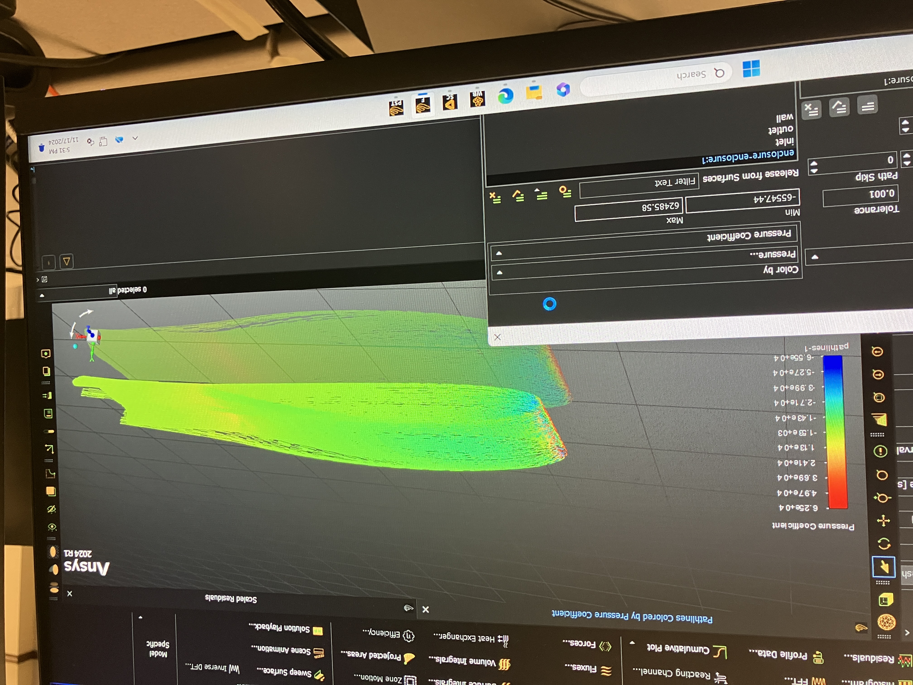
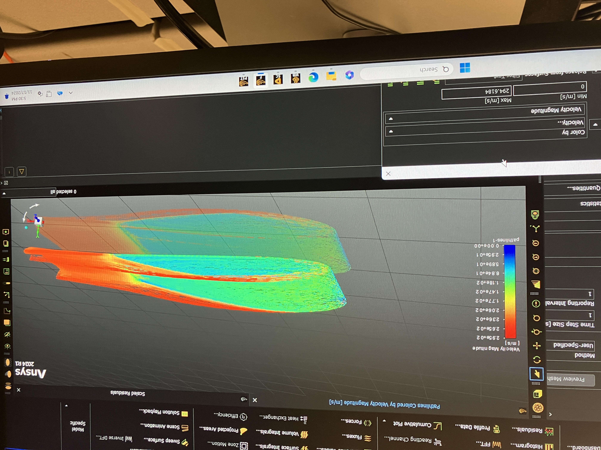
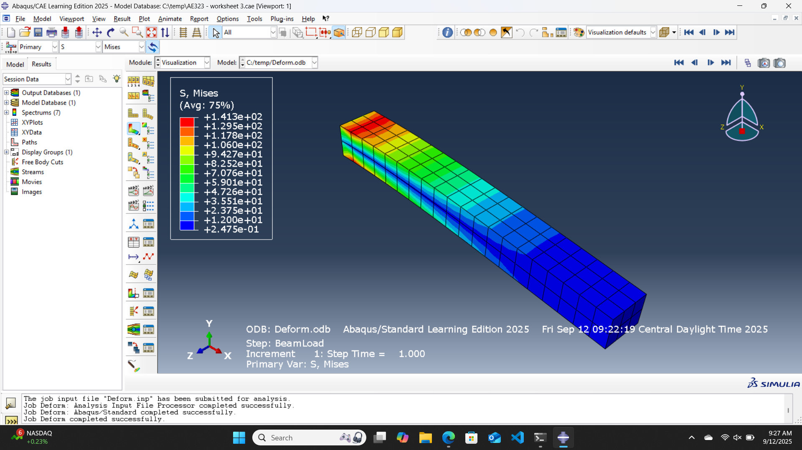
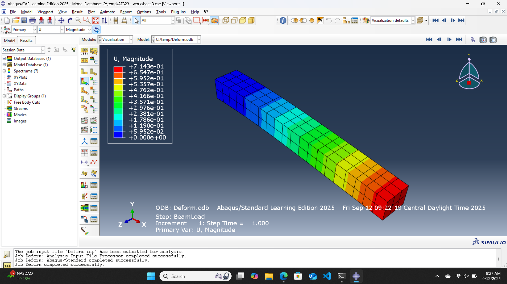
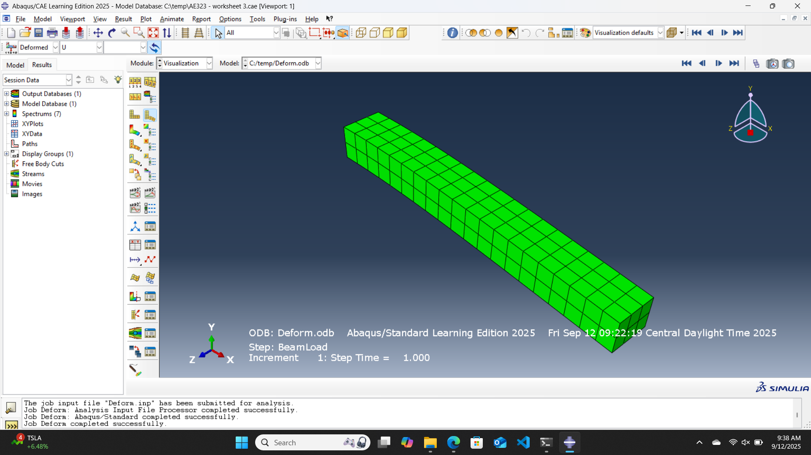
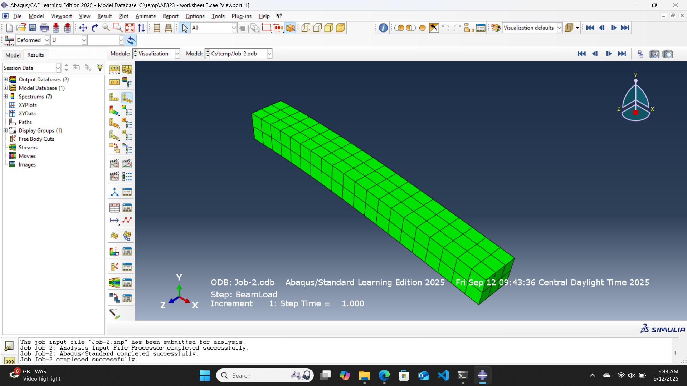
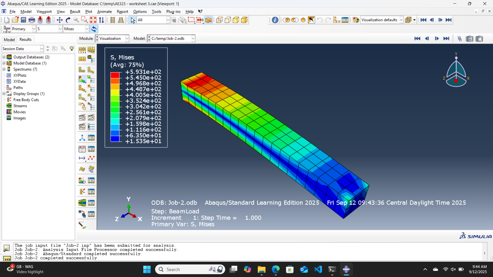
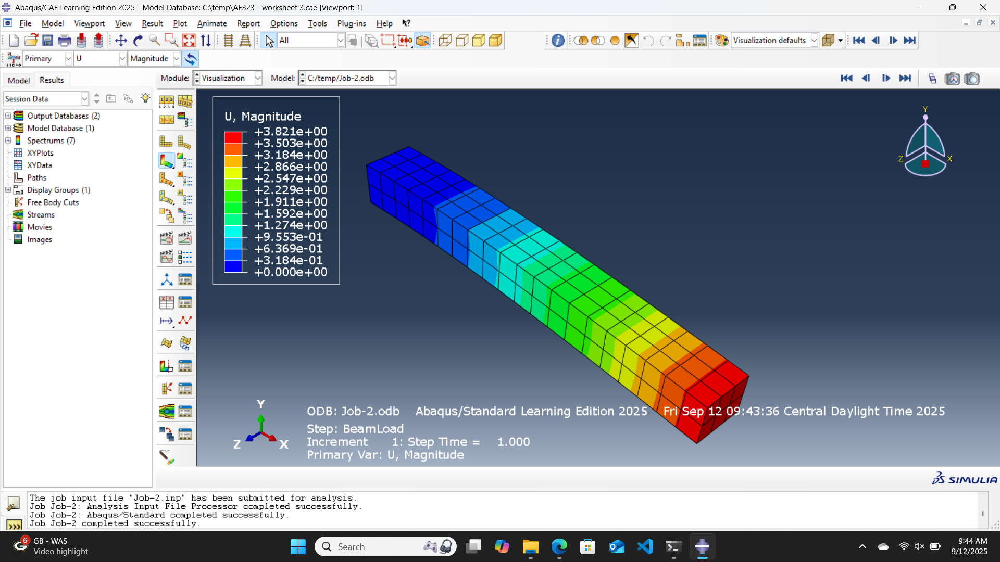
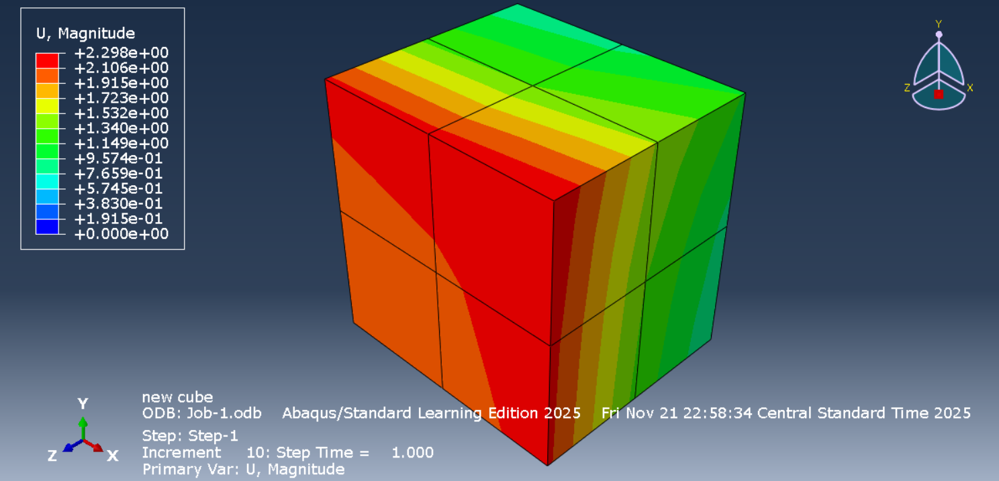
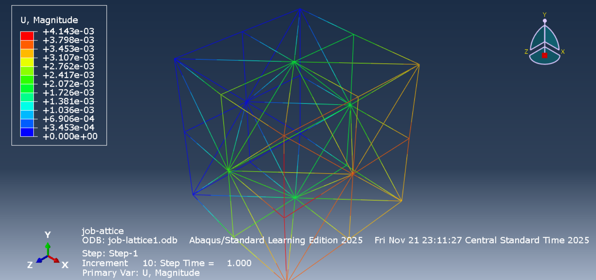

# Luke Phan – Aerospace Engineering Portfolio

## Overview

Welcome to my engineering portfolio. I am an Aerospace Engineering student at the University of Illinois Urbana-Champaign with interests in computational fluid dynamics, simulation, numerical methods, and engineering data analysis. 

This portfolio highlights simulation, analysis, and design projects involving CFD, FEA, CAD, post-processing, and Python-based engineering workflows.

---

## Featured Simulations

  
  
  

  
  
  
  
  
  
  
  

---

## About Me

I am an Aerospace Engineering student at UIUC interested in simulation-driven engineering, especially CFD and numerical analysis. My work combines aerospace coursework, personal simulation projects, and engineering internship experience involving Python-based data analysis for aerospace alloy manufacturing.

My current technical focus areas include:

- Computational fluid dynamics and aerodynamic post-processing
- Finite element analysis and structural simulation
- Mesh generation, mesh-quality assessment, and convergence studies
- Python-based engineering automation and visualization
- Data-driven manufacturing analysis and process-property modeling

---

## Projects

### Applied CFD Final Project – S1223 Airfoil Ground Effect Study  
**Tools:** SU2, Gmsh, ParaView, Python, NumPy, Pandas, Matplotlib

Built a full 2D CFD workflow to study an S1223 airfoil in ground effect. The project included geometry generation, mesh creation, SU2 solver setup, post-processing, and report-ready visualization.

Key work included:

- Generated 2D airfoil-ground geometries for multiple ground clearances using Python and Gmsh.
- Ran viscous CFD simulations in SU2 at \(M = 0.3\), \(Re = 3 \times 10^6\), and \(\alpha = 1^\circ\).
- Conducted a mesh refinement study from approximately 3.4K to 136K cells.
- Assessed coefficient trends, runtime scaling, and mesh-quality metrics.
- Used ParaView and Python to process aerodynamic coefficients, mesh-quality data, and visualization outputs.

---

### Personal CFD and FEA Projects  
**Tools:** ANSYS Fluent, ANSYS Mechanical, Python, ParaView

Completed personal simulation studies involving both fluid and structural analysis. These projects were used to strengthen practical understanding of meshing, solver setup, convergence behavior, validation, and post-processing.

CFD work included:

- Simulated compressible and incompressible flows including airfoils, nozzles, and internal flow geometries.
- Analyzed pressure distributions, lift/drag behavior, velocity fields, and flow structures.
- Performed mesh refinement and monitored convergence using residuals and result consistency.
- Compared selected CFD results with analytical solutions or expected physical trends.

FEA work included:

- Built structural models of beams and simplified components in ANSYS Mechanical.
- Evaluated stress distributions, deflections, and load-response behavior.
- Post-processed simulation outputs for visualization and interpretation.

---

### Formula SAE – Illini Electric Motorsports, Aero Team  
**Tools:** STAR-CCM+, CFD post-processing, manufacturing tools

Participated in aerodynamic design discussions and gained exposure to simulation-driven vehicle design through the Illini Electric Motorsports aero team.

Key work included:

- Interpreted CFD results including lift, drag, pressure coefficient distributions, and convergence behavior.
- Gained exposure to STAR-CCM+ workflows including geometry setup, turbulence model selection, and residual monitoring.
- Observed simulation-driven design decisions for multi-element aerodynamic configurations.
- Assisted with manufacturing structural components using machining, bonding processes, and hand tools.

---

### Combined Metals Company – Engineering Data Analysis Internship  
**Tools:** Python, Pandas, NumPy, scikit-learn, Jupyter, Excel

Worked on Python-based engineering analysis tools for aerospace alloy manufacturing data. The work focused on reducing manual analysis time, identifying process-property relationships, and supporting engineering decision-making.

Key work included:

- Developed Python ETL and analysis workflows for large metallurgical process datasets.
- Applied statistical analysis and machine learning methods including Random Forest, K-means clustering, and PCA.
- Analyzed yield strength, process variability, and manufacturing trends for aerospace alloy products.
- Presented data-driven findings to engineering leadership and supported decisions that helped prevent rejected material.

---

### SAB P-51D Project – Wing Team  
**Tools:** Siemens NX, sheet metal CAD, CNC machining

Contributed to the design and manufacturing of a scaled P-51D aircraft model as part of a student aircraft build team.

Key work included:

- Designed wing structure parts using Siemens NX sheet metal CAD tools.
- Incorporated manufacturing constraints and standards into CAD geometry.
- CNC-machined sheet metal parts and supported assembly of the scaled aircraft model.
- Collaborated with a 20+ member team across design, manufacturing, and integration tasks.

---

## Relevant Coursework

- Applied CFD
- Compressible Flow
- Incompressible Flow
- Numerical Methods
- Aerospace Control Systems
- Thermodynamics
- Aerospace Structures
- Engineering Materials

---

## Technical Skills

**Engineering & Simulation:** SU2, ANSYS Fluent, ANSYS Mechanical, Gmsh, ParaView, STAR-CCM+  
**Programming & Data Analysis:** Python, NumPy, Pandas, Plotly, Matplotlib, scikit-learn, Jupyter  
**CAD:** Creo, Siemens NX, Fusion 360  
**Productivity & Collaboration:** Microsoft Excel, SharePoint, Word, PowerPoint, Teams, Outlook  
**Manufacturing:** CNC machining, bonding processes, hand tools, basic mechanical fabrication

---

## Resume & Contact

- 📄 [Download Resume](Luke_Phan-Resume.pdf)
- 📧 Email: **lbphan2@illinois.edu**
- 🔗 LinkedIn: [linkedin.com/in/lukebphan](https://linkedin.com/in/lukebphan)

© 2026 Luke Phan – Engineering Portfolio
